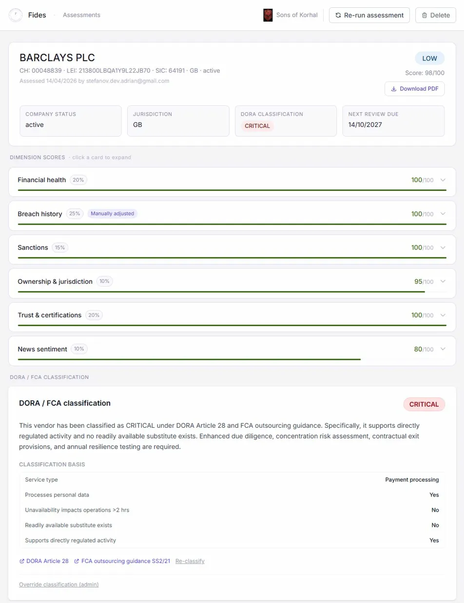

# Fides — Vendor Risk Assessment Platform



AI-assisted vendor risk assessment for financial services teams. Fides automates the time-consuming
data gathering required for third-party due diligence and produces a structured, auditable risk report
in minutes.

---

## For GRC Professionals

### What is Fides?

Fides is a web-based vendor risk assessment platform built for compliance, risk, and operations teams.
When you are onboarding a new third-party supplier — or reviewing an existing one — Fides automatically
pulls data from public registries, sanctions lists, trust portals, and news sources, then uses AI to
synthesise a risk score, executive summary, and recommended action. Every finding is saved with a full
audit trail and can be exported as a formal PDF report. No spreadsheets. No manual searching.

### What it checks

| Source | Data retrieved |
|---|---|
| **Companies House** | Company profile, active/dormant status, accounts filing status, going-concern notes, officers and persons of significant control |
| **GLEIF** | Legal Entity Identifier, jurisdiction of incorporation, ultimate parent entity |
| **OFSI / OFAC / EU sanctions** | Name-match screening against 44,000+ sanction entries from the UK, US and EU lists |
| **NCSC / Vanta / SafeBase** | ISO 27001, SOC 2, Cyber Essentials, PCI DSS and other security certifications from public trust portals |
| **NewsAPI + Claude AI** | Recent press coverage analysed for regulatory action, data breaches, financial distress, or reputational risk |
| **Have I Been Pwned** | Data breach history by domain, scored by recency and severity |

### Risk scoring

| Dimension | Weight | What drives it |
|---|---|---|
| Financial health | 20% | Company status, accounts overdue, going-concern flag |
| Breach history | 25% | HIBP breach count and recency |
| Sanctions | 15% | Match level against OFSI, OFAC, EU sanctions lists |
| Ownership & jurisdiction | 10% | GLEIF jurisdiction mapped against FATF grey/black lists |
| Trust & certifications | 20% | Presence of ISO 27001, SOC 2, Cyber Essentials and similar |
| News sentiment | 10% | AI assessment of recent news headlines |

### Risk tiers

| Score | Tier | Typical action |
|---|---|---|
| 75–100 | **LOW** | Standard monitoring, annual review |
| 50–74 | **MEDIUM** | Enhanced monitoring, 18-month review |
| 25–49 | **HIGH** | Due diligence questionnaire, 12-month review |
| 0–24 | **CRITICAL** | Escalate to board, 6-month review |

### Override rules

Certain findings override the numeric score regardless of total:

- **Any confirmed sanctions match** → minimum **HIGH**
- **Company status not Active** → minimum **HIGH**
- **Going concern note (high confidence)** → minimum **MEDIUM**

### DORA / FCA classification

After an assessment completes, an analyst completes a five-question classification form:

1. Service type (cloud/hosting, SaaS, data, payments, IT support, other)
2. Does the vendor process personal data?
3. Would unavailability impact operations for more than 2 hours?
4. Is there a readily available substitute?
5. Does the vendor support a directly regulated activity?

Fides uses Claude to derive a **CRITICAL**, **IMPORTANT**, or **STANDARD** DORA classification with
a written justification, referencing DORA Articles 28–31 and FCA SS2/21. Admin users can override the
classification with a reason, which is logged to the audit trail.

### Analyst tools

- **Manual score override** — adjust any dimension score with a mandatory reason; recorded in the audit trail
- **Manual certification entry** — add certifications not found automatically, with issuing body, dates and expiry
- **DORA / FCA classification** — structured five-question form with AI-generated justification
- **Contract & SLA** — store SLA uptime, RTO, RPO, contract expiry, account manager details
- **PDF report export** — formal multi-page PDF with cover, executive summary, scores, DORA, certs, audit trail
- **Due diligence questionnaire** — AI-assisted PDF questionnaire pre-populated from assessment findings
- **Audit trail** — immutable record of every assessment action with timestamp and user
- **Certification expiry alerts** — daily cron flags certs expiring within 90 days on the dashboard
- **Reassessment scheduling** — automatic schedule based on risk tier, "due for reassessment" widget on dashboard

---

## For Engineers

### Tech stack

| Layer | Technology | Notes |
|---|---|---|
| Framework | Next.js 15 (App Router) | Server components, API routes, streaming pipeline |
| Language | TypeScript 5 | Strict mode |
| UI | Tailwind CSS v4 | Arbitrary values, no preset config |
| Database | Neon (serverless Postgres) | Connection pooled via `@neondatabase/serverless` |
| ORM | Drizzle ORM | Schema-first, migrations via `drizzle-kit` |
| Auth | Auth0 (`@auth0/nextjs-auth0` v3) | JWT with custom namespace claims |
| AI | Anthropic Claude Sonnet 4.6 | Going-concern analysis, news sentiment, exec summary |
| PDF | `@react-pdf/renderer` v4 | Server-side PDF generation in Node.js API routes |
| Storage | Vercel Blob (private) | Org logo upload, served via server-side proxy route |

### Architecture decisions

**Multi-tenancy via `org_id`** — Every table that holds assessment data includes an `org_id` column.
Every API route and server component calls `getDbContext()`, which resolves the authenticated user's
organisation from the JWT claim `https://fides.app/org_id`. No cross-tenant data can be accessed
without a matching `org_id`.

**Assessment pipeline — 5 phases**
1. Companies House profile (serial — needed for officer names and website)
2. GLEIF, sanctions, news, trust portals, HIBP (parallel)
3. Claude AI analysis — going-concern and news sentiment (parallel)
4. Risk scoring — weighted dimension scores with tier override rules
5. DB transaction — inserts assessment, 6 scores, certifications, questionnaire trigger, reassessment schedule, audit log entry

Streamed as server-sent events so the UI shows live progress.

**JWT claim namespace** — Custom claims use `https://fides.app/` namespace as required by Auth0 to
avoid collision with standard OIDC claims. See `src/lib/auth.ts` for the `CLAIMS` constants.

**Feature flags** — `HIBP_ENABLED=false` in env skips the HIBP breach check (rate-limited API).

### Running locally

**Prerequisites:** Node.js 20+, a Neon Postgres database, an Auth0 tenant, an Anthropic API key.

```bash
git clone https://github.com/your-org/fides.git
cd fides
npm install
cp .env.example .env.local
# Fill in all variables in .env.local
npx drizzle-kit push
npm run sanctions:update
npm run dev
```

Open [http://localhost:3000](http://localhost:3000). On first login you will be redirected to `/onboarding`
to create your organisation.

### Environment variables

| Variable | Required | Description |
|---|---|---|
| `AUTH0_SECRET` | Yes | Long random string for cookie encryption |
| `AUTH0_BASE_URL` | Yes | Base URL of your app (e.g. `http://localhost:3000`) |
| `AUTH0_ISSUER_BASE_URL` | Yes | Your Auth0 tenant URL |
| `AUTH0_CLIENT_ID` | Yes | Auth0 application client ID |
| `AUTH0_CLIENT_SECRET` | Yes | Auth0 application client secret |
| `DATABASE_URL` | Yes | Neon pooled connection string |
| `DATABASE_URL_DIRECT` | Yes | Neon direct (non-pooled) connection string for migrations |
| `ANTHROPIC_API_KEY` | Yes | Anthropic API key |
| `COMPANIES_HOUSE_API_KEY` | Yes | Companies House REST API key |
| `NEWS_API_KEY` | Yes | NewsAPI.org key |
| `HIBP_API_KEY` | No | Have I Been Pwned API key (`HIBP_ENABLED=true` to activate) |
| `HIBP_ENABLED` | No | Set `true` to enable breach history checks (default `false`) |
| `BLOB_READ_WRITE_TOKEN` | Yes | Vercel Blob store token for private logo uploads |
| `CRON_SECRET` | Yes | Secret for `/api/cron/cert-alerts` — generate with `crypto.randomUUID()` |

### Database schema

13 tables defined in `src/db/schema.ts`:

| Table | Purpose |
|---|---|
| `organisations` | Multi-tenant root — every row belongs to an org |
| `users` | Auth0-linked users with role (VIEWER / ANALYST / ADMIN) |
| `assessments` | One row per vendor assessment run |
| `assessment_scores` | 6 dimension scores per assessment |
| `certifications` | Auto-detected and manually added certs per assessment |
| `dora_classification` | DORA/FCA classification form result per assessment |
| `audit_log` | Immutable insert-only audit trail |
| `questionnaires` | Generated questionnaire records with status |
| `reassessment_schedule` | Scheduled reassessment dates keyed to an assessment |
| `rate_limits` | Per-user daily assessment count |
| `cert_alerts` | Expiry alerts created by the daily cron |
| `invite_tokens` | Organisation member invite links |
| `sanctions_entries` | 44,000+ OFSI/OFAC/EU sanctions records |

### Key API routes

```
GET    /api/assessments                              List assessments (paginated)
POST   /api/assessments                              Start new pipeline (SSE stream)
GET    /api/assessments/[id]                         Fetch assessment record
DELETE /api/assessments/[id]                         Soft-delete assessment
GET    /api/assessments/[id]/pdf                     Generate and download PDF report
POST   /api/assessments/[id]/questionnaire           Generate and download questionnaire PDF
PATCH  /api/assessments/[id]/scores/[dim]            Override a dimension score
POST   /api/assessments/[id]/dora                    Submit DORA classification
PUT    /api/assessments/[id]/dora                    Override DORA classification (admin)
PUT    /api/assessments/[id]/contract                Save contract & SLA details
POST   /api/assessments/[id]/certifications          Add manual certification
DELETE /api/assessments/[id]/certifications/[certId] Remove certification

GET    /api/org                                      Get current org
PATCH  /api/org                                      Update org name / brand colour
DELETE /api/org                                      Delete org (danger zone)
POST   /api/org/logo                                 Upload org logo (private blob)
GET    /api/org/logo-image                           Serve private org logo (proxy)
POST   /api/org/invite                               Generate member invite link
PATCH  /api/org/members/[userId]                     Change member role
DELETE /api/org/members/[userId]                     Remove member

GET    /api/cron/cert-alerts                         Cert expiry cron (CRON_SECRET protected)
GET    /api/auth/[auth0]                             Auth0 callback handler
```

### Cron jobs

| Job | Schedule | Route | Auth |
|---|---|---|---|
| Cert expiry alerts | 09:00 UTC daily | `/api/cron/cert-alerts` | `x-vercel-cron-secret` header |

Configured in `vercel.json`. The cron queries all non-deleted certifications with `expiry_date <= NOW() + 90 days`
and upserts `cert_alerts` rows for each. The dashboard shows the alerts section when unacknowledged alerts exist.

### Sanctions data

44,000+ entries from OFSI (UK), OFAC (US), and EU sanctions lists are stored in the `sanctions_entries`
table. Fuzzy name-matching uses the Levenshtein distance implementation from `fastest-levenshtein`.

To refresh the sanctions data:

```bash
npm run sanctions:update
```

Run this monthly or after a major sanctions list update.

---

## Acknowledgements

- Built with [Claude Code](https://claude.ai/code) and the [Anthropic API](https://www.anthropic.com)
- Data sources: [Companies House](https://developer.company-information.service.gov.uk/), [GLEIF](https://www.gleif.org/), [OFSI](https://www.gov.uk/government/organisations/office-of-financial-sanctions-implementation), [OFAC](https://ofac.treasury.gov/), [EU sanctions](https://www.sanctionsmap.eu/), [NCSC](https://www.ncsc.gov.uk/), [NewsAPI](https://newsapi.org/), [Have I Been Pwned](https://haveibeenpwned.com/)
